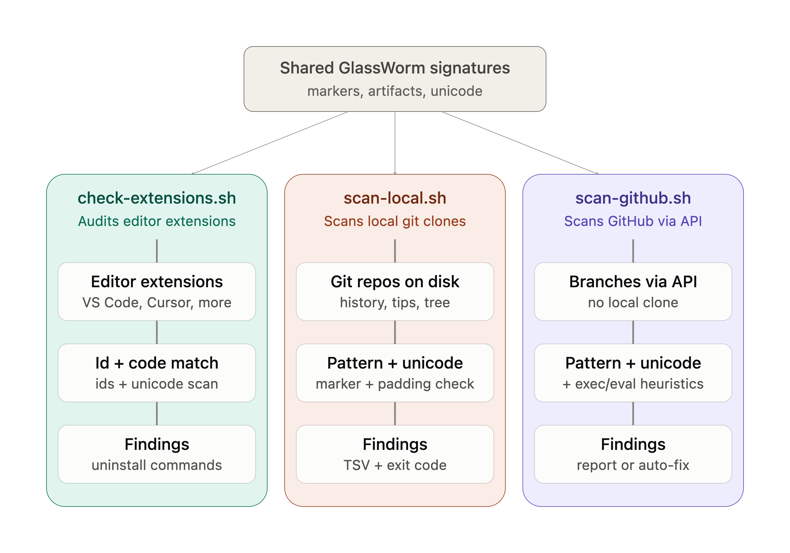
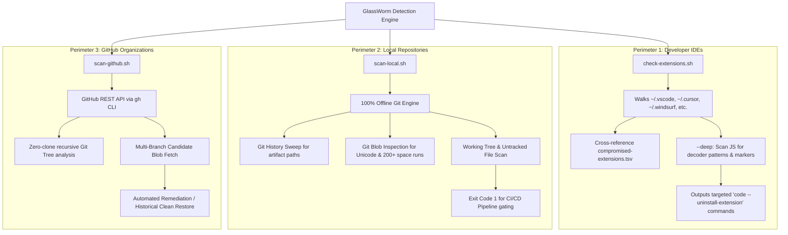
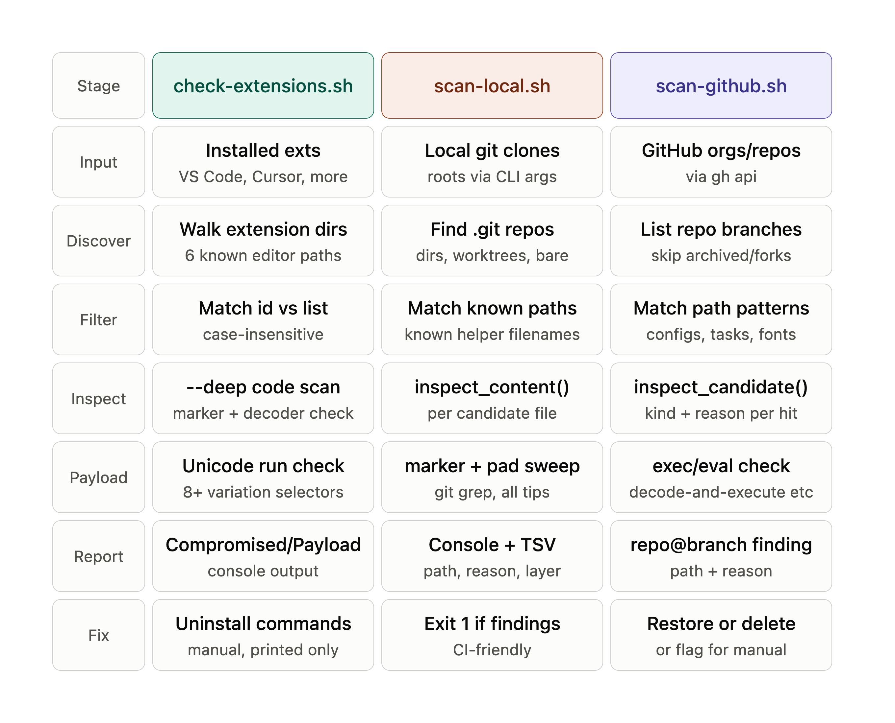

<div align="center">


# GlassWorm Scanner

**A high-precision, multi-layered security scanner and remediation toolkit for the GlassWorm supply-chain malware campaign.**

[](LICENSE)
[](https://www.gnu.org/software/bash/)
[]()
[]()
[](CONTRIBUTING.md)

[Overview](#overview) • [The Threat](#what-is-glassworm--what-are-we-solving) • [Architecture](#architecture) • [Comparison Matrix](#comparison-matrix) • [Installation](#installation--prerequisites) • [Usage Guide](#usage-guide) • [Incident Response](#incident-response-playbook) • [Contributing](#contributing) • [License](#license)

---

</div>

## Overview

**GlassWorm Scanner** is a specialized defense toolkit engineered to detect, audit, and remediate the elusive **GlassWorm** developer supply-chain malware.

GlassWorm propagates through compromised Visual Studio Code and OpenVSX extensions, infecting developer workstations, code repositories, and IDE configuration files. It uses advanced evasion techniques—including **invisible Unicode variation selectors**, **extreme whitespace padding**, **masqueraded font binaries**, and **IDE task hijacking**—to execute arbitrary code and silently spread across Git branches.

This repository provides three complementary, zero-trust tools tailored for developers, DevOps, and AppSec teams:

1. **`check-extensions.sh`** — Audits installed extensions across 7+ IDEs against 325+ known-compromised extension IDs, with deep bytecode/regex heuristics for unlisted waves.
2. **`scan-local.sh`** — 100% offline, read-only scanner for local Git clones, branch tips, commit history, and working trees.
3. **`scan-github.sh`** — Cloud-native, zero-clone scanner and automated remediator that audits GitHub organizations and branches via the GitHub API.

---

## What is GlassWorm & What Are We Solving?

The GlassWorm malware campaign represents a sophisticated evolution in developer-targeted software supply chain attacks. Unlike traditional malware that triggers loud alerts, GlassWorm utilizes steganographic and IDE-native persistence mechanisms:

```
┌─────────────────────────────────────────────────────────────────────────────────────────┐
│                              GLASSWORM ATTACK LIFECYCLE                                 │
└─────────────────────────────────────────────────────────────────────────────────────────┘
   1. INFECTION              2. PERSISTENCE                3. EXECUTION            4. PROPAGATION
 Compromised Extension  ──► .vscode/tasks.json       ──► Node.js executes  ──►  Steals Git Tokens &
 (VS Code / Cursor /        (folderOpen auto-exec)       fake font payload      Commits spoofed code
 Windsurf / VSCodium)   ──► .vscode/settings.json        (fa-solid-400.woff2)   across all branches
                            (task auto-allow bypass) ──► Hidden payload in
                        ──► Invisible Unicode in         postcss/next.config
                            JS/TS config files
```

### The Evasion Techniques We Defeat

| Attack Vector | Malware Technique | Why Standard Scanners Fail | How GlassWorm Scanner Solves It |
| :--- | :--- | :--- | :--- |
| **Invisible Unicode Payloads** | Encodes executable bytes into runs of Unicode Variation Selectors (`U+FE00`–`U+FE0F`, `U+E0100`–`U+E01EF`). | Text renders normally on-screen; standard diffs and grep tools fail to flag them. macOS BSD grep silently skips high-byte brackets. | Uses a custom byte-level Perl engine (`VS_RUN_MIN=8`) to detect variation selector sequences without false positives on emoji/BOMs. |
| **Off-Screen Whitespace Padding** | Injects payloads after 200+ spaces/tabs on a single line at the bottom of configs (`next.config.js`, `postcss.config.mjs`). | Editors truncate or wrap the screen; human review and naive linters miss code pushed off-screen. | Runs regex sweeps (`PAD_MIN=200`) across all tracked Git blobs and disk files, filtering out minified bundle false positives. |
| **Fake Font Execution** | Drops malicious JS disguised as font files (e.g. `public/fonts/fa-solid-400.woff2`). | Asset directories are frequently excluded from source code security reviews. | Verifies MIME type and magic bytes (`file -b`), detecting ASCII/script payloads disguised as `.woff2`, `.ttf`, or `.eot`. |
| **Silent IDE Task Hijack** | Registers `folderOpen` tasks in `.vscode/tasks.json` and auto-enables them via `.vscode/settings.json`. | Developers automatically run malware simply by opening the repository in VS Code or Cursor. | Audits `.vscode` configurations for unauthorized `folderOpen` tasks and `allowAutomaticTasks` prompt suppressors. |
| **History & Branch Poisoning** | Injects helper scripts (`temp_auto_push.bat`, `branch_structure.json`) and force-pushes with spoofed commit authors. | Scanners only checking the default branch (`main`) miss malware residing on stale or feature branches. | Traverses all Git ref namespaces (`refs/heads`, `refs/tags`, `refs/remotes`) and scans commit trees recursively. |

---

## Architecture

The toolkit operates across three concentric security perimeters: **Workstation / IDEs**, **Local File System / Git Clones**, and **Remote GitHub Organizations**.

<div align="center">



</div>

### Detection Pipeline



---

## Comparison Matrix

<div align="center">



</div>

| Feature / Capability | `check-extensions.sh` | `scan-local.sh` | `scan-github.sh` |
| :--- | :---: | :---: | :---: |
| **Target Perimeter** | Installed IDE Extensions | Local Git Clones & Working Trees | Remote GitHub Repositories |
| **Network Requirement** | Purely Offline | 100% Offline (Network disabled) | GitHub API (`gh` authenticated) |
| **Local Disk Modification** | ❌ None (Read-only) | ❌ None (Read-only, no locks) | ❌ None (Zero-clone) |
| **Remote Modification** | ❌ None | ❌ None | ✅ Optional (`--clean-github`) |
| **Target Editors / Platforms** | VS Code, Insiders, Cursor, Windsurf, VSCodium, OpenVSX | Any local repository | All GitHub public / private repositories |
| **Signature Matching** | 325+ Extension IDs (Waves 1–6) | Known helper filenames & hashes | Artifact path regexes |
| **Heuristic / Code Analysis** | Unicode variation run + `codePointAt` | Whitespace padding (`>200`), PolinRider markers | Exec/eval heuristics, fake fonts, task triggers |
| **History Analysis** | N/A | Full Git history reachable from refs | Commit history back-tracing per branch |
| **Remediation Action** | Prints uninstall commands | Flags infected paths & exits 1 | Automated restoration / safe deletion |

---

## Installation & Prerequisites

### Prerequisites

- **Operating System:** macOS or Linux (Ubuntu, Debian, Fedora, Arch, etc.)
- **Shell:** `bash` (v4.0+ recommended)
- **Utilities:** `perl` (5.10+), `file`, `base64`, `awk`, `sed`, `grep`, `git`
- **For GitHub Scanning (`scan-github.sh`):** [GitHub CLI (`gh`)](https://cli.github.com/) authenticated (`gh auth login`).

### Quick Start

```bash
# Clone the repository
git clone https://github.com/ankush-westack/glassworm-scanner.git
cd glassworm-scanner

# Make scripts executable
chmod +x check-extensions.sh scan-local.sh scan-github.sh
```

---

## Usage Guide

### 1. Auditing Installed Editor Extensions (`check-extensions.sh`)

Audits all extensions installed in your development environment against the curated threat intelligence database (`data/compromised-extensions.tsv`).

```bash
# Fast mode: Check installed extension IDs against known-compromised database
./check-extensions.sh

# Deep mode: Additionally inspect extension JavaScript bundles for invisible Unicode and decoders
./check-extensions.sh --deep
```

#### Supported Editor Directories:
- `~/.vscode/extensions` (VS Code)
- `~/.vscode-insiders/extensions` (VS Code Insiders)
- `~/.vscode-oss/extensions` (Open Source VS Code builds)
- `~/.cursor/extensions` (Cursor AI IDE)
- `~/.windsurf/extensions` (Windsurf IDE)
- `~/.vscodium/extensions` (VSCodium)
- `~/.openvsx/extensions` (OpenVSX Clients)

#### Example Output:
```text
GlassWorm extension audit
Known-bad list: 329 extension IDs

~/.cursor/extensions (42 installed)
  COMPROMISED myml.vscode-markdown-plantuml-preview-1.5.0  [wave-3 · Koi Security]
              uninstall: code --uninstall-extension myml.vscode-markdown-plantuml-preview

=== Summary ===
Extensions inspected: 42   Known-bad matches: 1   Payload-pattern hits: 0
Remove the extensions above, then rotate every credential on this machine.
```

---

### 2. Scanning Local Git Clones (`scan-local.sh`)

Scans local Git repositories, bare mirrors, and loose directories for worm footprints. Guarantees 100% offline execution by disabling Git network transports, credentials, and index locks.

```bash
# Scan default search paths (~/Projects and ~/github)
./scan-local.sh

# Scan specific directories or repositories
./scan-local.sh ~/workspace /var/www /opt/code

# Output structured TSV report for ingestion into SIEM / SecOps
./scan-local.sh --tsv /tmp/glassworm_findings.tsv ~/Projects

# Include cached remote-tracking branches (refs/remotes/*)
./scan-local.sh --include-remote-refs ~/Projects
```

#### Exit Codes (CI/CD Ready):
- `0` — Clean: No GlassWorm indicators detected.
- `1` — Infected: One or more indicators detected.
- `2` — Syntax or argument error.

#### Example Output:
```text
GlassWorm local scan
Roots: /Users/developer/Projects
Started: Wed Aug 19 13:15:00 2026

[1] ~/Projects/frontend-app
  FOUND    tip:refs/heads/feature-login  public/fonts/fa-solid-400.woff2  [fake-font-is-text,known-payload-name]
  FOUND    tip:refs/heads/feature-login  .vscode/tasks.json               [tasks.json-folderOpen-font-exec]
  FOUND    content                       postcss.config.mjs               [code-hidden-after-200+-spaces]

=== Summary ===
Repos scanned: 18   Non-repo folders scanned: 0   Findings: 3
Repos with findings (1):
  ~/Projects/frontend-app
```

---

### 3. Scanning & Remediating Remote GitHub Repositories (`scan-github.sh`)

Performs zero-clone inspection of GitHub repositories and entire organizations using `gh api`. It checks all active branches, identifies the newest uncompromised historical commit for each infected file, and can automatically remediate the repository directly on GitHub.

```bash
# Scan all repositories under an organization
./scan-github.sh my-org

# Scan a single repository
./scan-github.sh my-org/frontend-app

# Scan multiple organizations or target lists
./scan-github.sh org-one org-two user/repo --repos-from targets.txt

# Include archived repositories and forks
./scan-github.sh my-org --include-archived --include-forks

# Preview automated GitHub remediation without making any changes
./scan-github.sh my-org/frontend-app --dry-run-github

# Execute safe automated remediation directly via GitHub API
./scan-github.sh my-org/frontend-app --clean-github
```

#### Safe Remediation Rules:
- **Configurations (`next.config.js`, `postcss.config.mjs`, `tasks.json`):** Restores the file from the latest verified clean historical commit on that branch. If no clean history exists, leaves it untouched and flags for manual review.
- **Known Helper Artifacts (`temp_auto_push.bat`, `branch_structure.json`):** Deletes directly via API commit.
- **Fake Text Fonts (`fa-solid-400.woff2`):** Restores clean binary font from history, or deletes text-based payload fonts.
- **Poisoned `.gitignore`:** Strips malware helper patterns while preserving user rules.

#### Example Output:
```text
[1/5] my-org/frontend-app
  Branch: feature-auth (3 candidate blobs checked)
    INFECTED  my-org/frontend-app@feature-auth  public/fonts/fa-solid-400.woff2  [text-not-binary,known-payload-name]
    INFECTED  my-org/frontend-app@feature-auth  .vscode/tasks.json               [tasks.json:folderOpen+font-exec]

--- Remediation (Mode: clean-github) ---
  my-org/frontend-app@feature-auth  .vscode/tasks.json
      detected: tasks.json:folderOpen+font-exec
      clean history: e8b9f1a2c3d4
      CLEANED GitHub commit a1b2c3d4e5f6
      VERIFIED current GitHub file passes scanner
  my-org/frontend-app@feature-auth  public/fonts/fa-solid-400.woff2
      detected: text-not-binary,known-payload-name
      DELETED + VERIFIED GitHub commit f6e5d4c3b2a1

=== GitHub Scan & Remediation Summary ===
Repositories Audited: 5   Branches Inspected: 24   Total Findings: 2
Files Successfully Remediated: 2   Manual Review Required: 0   Failures: 0
```

---

## Detection Signatures & Threat Intelligence

The repository includes a continuously updated threat intelligence feed at [`data/compromised-extensions.tsv`](data/compromised-extensions.tsv).

### Indicators of Compromise (IoCs)

```text
├── Markers & Obfuscator Signatures
│   ├── lzcdrtfxyqiplpd             (ForceMemo wave marker)
│   ├── rmcej%otb%                  (PolinRider obfuscator fingerprint)
│   ├── Cot%3t=shtP                 (PolinRider obfuscator fingerprint)
│   └── String.fromCharCode(127)    (Loader delimiter pattern)
│
├── Known Malware Helper Files
│   ├── temp_auto_push.bat          (Automated Git committer & force-pusher)
│   ├── temp_interactive_push.bat   (Interactive Git push script)
│   ├── branch_structure.json       (Branch tree metadata tracker)
│   ├── config.bat                  (Author spoofing and time-manipulation tool)
│   └── .vscode/spellright.dict     (Disguised payload stage)
│
├── Fake Asset Names
│   └── fa-solid-400.woff2          (Disguised ASCII payload in public/fonts/)
│
└── IDE Hijack Patterns
    ├── "runOn": "folderOpen"       (.vscode/tasks.json automatic execution)
    └── "task.allowAutomaticTasks"  (.vscode/settings.json prompt suppressor)
```

---

## Incident Response Playbook

If GlassWorm Scanner identifies an infection on your machine or repository, follow this immediate containment workflow:

> [!CAUTION]
> GlassWorm is designed to capture authentication tokens, SSH credentials, and environment secrets. Treat any machine with an active infection as fully compromised.

```
┌────────────────────────────────────────────────────────────────────────────────┐
│                        INCIDENT RESPONSE WORKFLOW                              │
├────────────────────────────────────────────────────────────────────────────────┤
│ 1. ISOLATE        Disconnect machine from corporate network / VPN.             │
│ 2. PURGE EXTS     Run 'code --uninstall-extension <id>' for flagged extensions.│
│ 3. DISABLE AUTO   Set "extensions.autoUpdate": false in VS Code settings.      │
│ 4. REMEDIATE REPO Run './scan-github.sh <repo> --clean-github' or restore      │
│                   clean commit history.                                        │
│ 5. ROTATE TOKENS  Immediately invalidate & rotate:                             │
│                   • GitHub Personal Access Tokens (PATs) & SSH Keys            │
│                   • NPM, PyPI, and package registry publish tokens             │
│                   • AWS, GCP, and cloud provider API credentials               │
│                   • Local .env secrets & development API keys                  │
└────────────────────────────────────────────────────────────────────────────────┘
```

---

## CI/CD Pipeline Integration

You can integrate `scan-local.sh` into your GitHub Actions CI workflow to prevent infected pull requests from being merged:

```yaml
name: GlassWorm Security Audit

on:
  push:
    branches: [ main, master, develop ]
  pull_request:
    branches: [ main, master, develop ]

jobs:
  glassworm-scan:
    name: Scan for GlassWorm Malware
    runs-on: ubuntu-latest
    steps:
      - name: Checkout repository
        uses: actions/checkout@v4
        with:
          fetch-depth: 0 # Fetch full history for deep audit

      - name: Clone GlassWorm Scanner
        run: git clone https://github.com/ankush-westack/glassworm-scanner.git /tmp/glassworm-scanner

      - name: Run Local Scan
        run: |
          chmod +x /tmp/glassworm-scanner/scan-local.sh
          /tmp/glassworm-scanner/scan-local.sh --include-remote-refs .
```

---

## Contributing

We welcome and appreciate contributions from the security, DevOps, and open-source communities! Whether you want to **add a new feature**, **extend detection heuristics**, **support new editors/platforms**, or **update threat intelligence**, here is how you can get involved.

---

### 🌟 Ways to Contribute

You can help make GlassWorm Scanner more powerful by proposing features and submitting Pull Requests for:

* **🚀 New Features & Capabilities:**
  * Support for additional Git hosting providers (e.g., **GitLab API**, **Bitbucket Cloud / Server**, **Gitea / Forgejo**).
  * New output formats (e.g., **SARIF** for GitHub Security tab integration, structured **JSON**, **HTML audit reports**).
  * **Pre-commit git hooks** and **standalone Docker image** packaging.
  * Auto-remediation rollback / snapshot verification tooling.
* **🛡️ Threat Intelligence & Signatures:**
  * Reporting and cataloging newly discovered GlassWorm waves, sleeper extensions, and malicious publishers.
  * Adding newly observed obfuscator fingerprints or payload delivery patterns.
* **💻 Additional IDE & Editor Support:**
  * Adding extension path detection for emerging editors (e.g., **Zed**, **Trae**, **Positron**, **Eclipse Theia**).
* **⚡ Detection Engine & Performance:**
  * Improving speed and memory efficiency for ultra-large monorepos.
  * Enhancing heuristics to eliminate false positives while keeping high true-positive sensitivity.
* **📖 Documentation & CI/CD Examples:**
  * Adding tutorials, CI/CD pipeline recipes (GitLab CI, Bitbucket Pipelines, Jenkins), and translations.

---

### 🔄 Step-by-Step PR Workflow

1. **Fork & Branch:**
   ```bash
   # Fork the repository on GitHub, then clone your fork locally:
   git clone https://github.com/<your-username>/glassworm-scanner.git
   cd glassworm-scanner

   # Create a descriptive feature branch
   git checkout -b feature/add-sarif-output-support
   # or
   git checkout -b threat-intel/wave-7-extensions
   ```

2. **Develop & Implement:**
   * Write clean, self-documenting shell/Perl code.
   * Maintain the core security guarantees (see [Development Standards](#development--safety-standards) below).

3. **Validate & Test Locally:**
   ```bash
   # 1. Run shellcheck to catch syntax and portability issues
   shellcheck check-extensions.sh scan-local.sh scan-github.sh

   # 2. Test against local repositories and check offline safety
   ./scan-local.sh --include-remote-refs .
   ./check-extensions.sh --deep
   ```

4. **Commit with Clear Messages:**
   Use clear, conventional commit messages:
   ```bash
   git commit -m "feat(reporter): add SARIF JSON export flag to scan-local.sh"
   ```

5. **Submit a Pull Request (PR):**
   * Push your branch to your GitHub fork:
     ```bash
     git push origin feature/add-sarif-output-support
     ```
   * Open a **Pull Request** against `main` on the [glassworm-scanner repository](https://github.com/ankush-westack/glassworm-scanner/pulls).
   * Fill in the PR description detailing what was added/changed, motivation, and any testing performed.

---

### 📋 Specific Contribution Guidelines

#### 1. Adding New Compromised Extension IDs
To add newly discovered malicious extension IDs:
1. Open [`data/compromised-extensions.tsv`](data/compromised-extensions.tsv).
2. Append the verified entry in the TSV format:
   ```text
   publisher.extension-name<TAB>wave-identifier<TAB>Source / Security Advisory Reference
   ```
3. Include reference links to the security advisory (e.g., Koi Security, Socket.dev, Checkmarx, CVE) in your PR description.

#### 2. Adding Detection Signatures or Heuristics
When adding new regex patterns or content checks:
* Verify against benign codebases (e.g., standard minified bundles, font libraries like `pdf.js` / `opentype.js`) to ensure **zero false positives**.
* Ensure byte-level compatibility across both **GNU/Linux** (`grep`/`perl`) and **macOS BSD** environments.

---

### 🛡️ Development & Safety Standards

All PRs must adhere to these foundational principles:

| Invariant | Requirement |
| :--- | :--- |
| **Zero Network Activity (`scan-local.sh`)** | Must never make network calls, trigger credential prompts, or take repository index locks. |
| **Safe Remediation (`scan-github.sh`)** | Never delete user configurations without verifying historical clean commits. |
| **Portability** | Must run on Bash 3.2+ / 4.0+ across both macOS and Linux. Avoid non-standard dependencies. |
| **ShellCheck Compliance** | Must pass `shellcheck` with zero severe warnings. |

---

## Threat Intelligence References & Acknowledgments

This toolkit synthesizes research and indicators from:
- [Koi Security](https://www.koisecurity.com/) (Waves 1–5 analysis, Native binary findings)
- [Socket.dev](https://socket.dev/) (73-sleeper extension campaign, transitive infection analysis)
- [Checkmarx Zero](https://checkmarx.com/) (Supply chain threat intelligence)
- [Truesec Research](https://www.truesec.com/)
- [Manifold Security](https://manifold.security/) (Evil-twin extensions)
- [StepSecurity](https://www.stepsecurity.io/), [Aikido Security](https://www.aikido.dev/), [JFrog](https://jfrog.com/)

---

## License

This project is licensed under the [MIT License](LICENSE) — see the [LICENSE](LICENSE) file for details.
